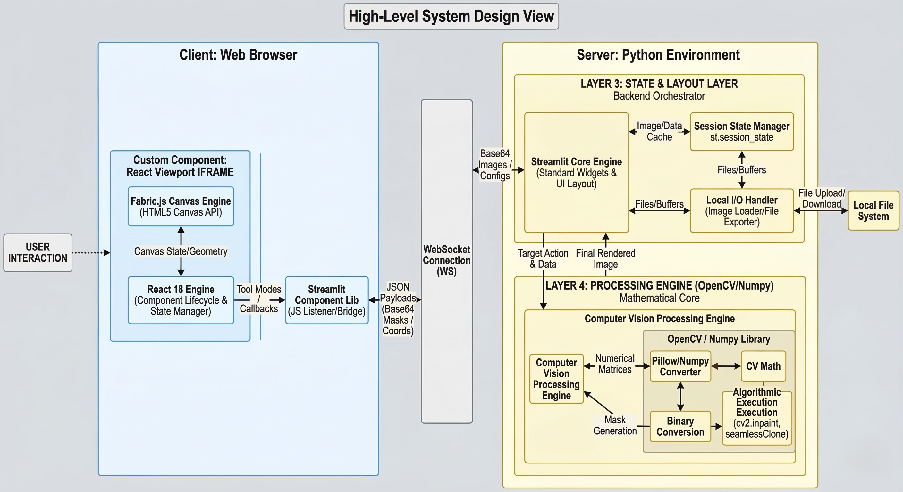

# AI-Powered Annotation Web App 

A professional-grade, full-stack Computer Vision based Annotation App built with **Streamlit**, **React 18**, and **OpenCV**. 

This application bridges the gap between high-performance Python image processing and interactive web-based annotation. By leveraging a custom bi-directional React frontend, it provides a seamless user experience for object cloning, image restoration, and dataset labeling.

---

## Full-Stack Architecture

The system utilizes a **Bidirectional Component Model** to synchronize a heavy JavaScript frontend with a mathematically intense Python backend.



### Key Engineering Pillars:
* **React 18 & Fabric.js Canvas:** Handles high-FPS interactions, zoom/pan deltas, and pixel-perfect coordinate tracking.
* **MIME-Type Force Injection:** Implements a Windows Registry override in Python to ensure `.js` chunks are served as executable code.
* **Coordinate Normalization:** Disables browser-side canvas scaling to guarantee 1:1 pixel mapping between the browser and OpenCV matrices.
* **Persistent State Management:** Uses React `useRef` and Python `st.session_state` to allow UI changes without destroying the canvas or losing progress.

---

## Features & Demos

The studio is organized into three specialized workspaces:

### 1. Seamless Clone (Poisson Blending)
Harnesses OpenCV’s gradient-domain processing to blend objects into new environments flawlessly.

* **Interactive Lasso:** High-precision polygon tracing.
* **Live Projection:** Real-time green silhouette overlay on the target image to preview placement.
* **Dynamic Scaling:** Standardized letterboxed previews ensure the UI remains compact and aligned.

[](https://drive.google.com/file/d/1IC6smsFo8QvDdTySVbTXZfmdveIJWca9/view?usp=sharing)

---

### 2. Smart Inpainting (Object Removal)
Uses the Telea algorithm to mathematically estimate and fill in missing image data.

* **Translucent Brush:** A custom 40% opacity green brush for surgical precision.
* **Binary Thresholding:** Semi-transparent frontend strokes are converted into 8-bit binary masks for the engine.
* **Precision Undo:** Dedicated stroke-by-stroke undo functionality for complex restoration tasks.

[](https://drive.google.com/file/d/101jPOZ7AKNsknOXg2XWogFzOv0Kh6wBs/view?usp=sharing)

---

### 3. Custom COCO Annotator
A dedicated environment for creating multi-class machine learning datasets.

* **Multi-Tool Annotation:** Support for both Bounding Boxes (Square) and Segmentation (Polygons).
* **Automated Workflow:** Canvas automatically wipes and assigns a new random color for the next object upon saving.
* **Live Preview:** Renders saved annotations with translucent fills for better visibility.
* **COCO JSON Export:** One-click generation of industry-standard COCO format JSON files.

[](https://drive.google.com/file/d/1DJt7wYAj-M5Sqy3E33eri8yorpHI0YVk/view?usp=sharing)

---

## Installation & Setup

### Prerequisites
* **Python 3.9+**
* **Node.js (v16+) & npm**


### 1. Environment Setup
```bash
# Install Python dependencies
pip install -r requirements.txt
```

### 3. Run the Studio
```bash
streamlit run app.py
```

---

## Pro Tips
* **Right-Click is Key:** Use **Left-Click** to draw/paint and **Right-Click** to finalize your shape and send the coordinates to Python.
* **Zoom/Pan:** Use the mouse wheel to zoom in for detail. Toggle to "Pan" mode to move around the image without drawing.
* **Rotation:** Use the rotation buttons to fix the orientation of mobile-uploaded photos before you start annotating.
* **Undo Support:** Use the "Undo" button in the Lasso and Inpaint tools to correct mistakes without restarting your trace.
```

##  Author

**Tanup Vats**